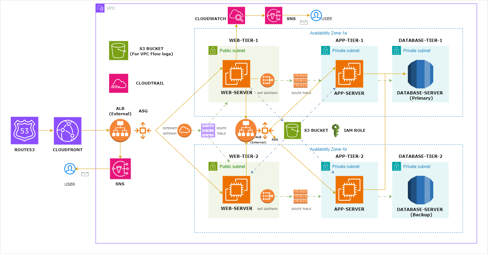

# AWS Three Tier Web Architecture

## Architecture Overview

In this architecture, a public-facing Application Load Balancer forwards client traffic to web tier EC2 instances. The web tier is running Nginx webservers that are configured to serve a React.js website and redirects our API calls to the application tier’s internal facing load balancer. The internal facing load balancer then forwards that traffic to the application tier, which is written in Node.js. The application tier manipulates data in an Aurora MySQL multi-AZ database and returns it to our web tier. Load balancing, health checks and autoscaling groups are created at each layer to maintain the availability of this architecture

## Architecture Overview

### Web Tier

- **Web Server**: Powered by `nginx` to serve static content and handle HTTP requests.
- **Frontend**: Built with `NodeJS` and React for a dynamic user interface.
- **Port**: Operates on port `80`.
- **Subnets**:
  - `10.0.1.0/24` (Availability Zone 1a)
  - `10.0.4.0/24` (Availability Zone 1b)
- **Networking**: Requires a `NAT Gateway` with an associated route table for private subnet access to the internet.

### Application Tier

- **Backend**: Uses `NodeJS` for server-side logic.
- **Database Access**: Connects to `MySQL` for data operations.
- **Port**: Runs on port `4000`.
- **Subnets**:
  - `10.0.2.0/24` (AZ 1a)
  - `10.0.5.0/24` (AZ 1b)

### Database Tier

- **Database Engine**: Utilizes `MySQL` for relational data storage.
- **Port**: Accessible on port `3306`.
- **Subnets**:
  - `10.0.3.0/24` (AZ 1a)
  - `10.0.6.0/24` (AZ 1b)

### Additional AWS Resources

- **VPC**: Configured with CIDR `10.0.0.0/16` to encompass all tiers.
- **High Availability**:
  - Resources deployed across at least two Availability Zones (AZs).
  - Uses two `Application Load Balancers`:
    - 1 external (for Web Tier)
    - 1 internal (for App Tier).
- **Fault Tolerance**:
  - `Auto Scaling` enabled for Web and App Tiers to handle traffic fluctuations.
  - Multi-AZ deployment for the Database Tier.
  - Load balancers distribute traffic efficiently.
- **Security**:
  - Ports `4000` (App Tier) and `3306` (DB Tier) are secured with restricted access.
- **Storage & Monitoring**:
  - `S3` bucket stores code for Web and App Tiers, with `IAM` roles for server access.
  - `Internet Gateway` provides public internet access to Web Tier subnets.
  - Another `S3` bucket captures VPC flow logs for auditing.
  - `CloudWatch` monitors servers and triggers `SNS` notifications to developers when needed.
- **Scaling & Alerts**:
  - `Auto Scaling Groups (ASG)` dynamically adjust server capacity.
  - `SNS` notifies developers of scaling events or issues.

## Project Development Steps

This section outlines the steps to set up the 3-tier web architecture on AWS

<strong>Setting up S3 and Network Connections</strong>

- **Code Storage**: Download the project code and upload the `application code` folder to a new `S3` bucket.
- **IAM Role**: Create an `IAM Role` for EC2 instances with the following policies:
  - `AmazonS3ReadOnlyAccess` (for code access).
  - `AmazonSSMManagedInstanceCore` (for Systems Manager access).
- **VPC Setup**: Create a `VPC` with the CIDR block `10.0.0.0/16`.
- **Subnets**: Create 6 subnets across two Availability Zones (AZs) using the specified CIDR blocks:
  - Web Tier: `10.0.1.0/24` (AZ 1a), `10.0.4.0/24` (AZ 1b) — enable auto-assign public IPs.
  - App Tier: `10.0.2.0/24` (AZ 1a), `10.0.5.0/24` (AZ 1b).
  - DB Tier: `10.0.3.0/24` (AZ 1a), `10.0.6.0/24` (AZ 1b).
- **VPC Flow Logs**: Set up flow logs for the VPC and store them in a new `S3` bucket.
- **Internet Gateway**: Create and attach an `Internet Gateway` to the VPC for public access.
- **Web Tier Routing**: Create a `Route Table` for Web Tier subnets with:
  - Route: `0.0.0.0/0` → `Internet Gateway`.
  - Subnet Associations: `web-tier-subnet-1` and `web-tier-subnet-2`.
- **NAT Gateways**: Create `NAT Gateways` for each Web Tier subnet:
  - One in `web-tier-subnet-1` and one in `web-tier-subnet-2`.
  - Set connectivity type to `public` and allocate an Elastic IP for each.
- **App Tier Routing (AZ 1)**: Create a `Route Table` for App Tier in AZ 1 with:
  - Route: `0.0.0.0/0` → `NAT Gateway` in `web-tier-subnet-1`.
  - Subnet Association: `App-tier-subnet-1`.
- **App Tier Routing (AZ 2)**: Create a `Route Table` for App Tier in AZ 2 with:
  - Route: `0.0.0.0/0` → `NAT Gateway` in `web-tier-subnet-2`.
  - Subnet Association: `App-tier-subnet-2`.
- **Note**: App and DB Tiers in the same AZ communicate within the VPC without additional routes.

---

<strong>Creating Security Groups</strong>

Configure the following security groups with specific inbound rules to ensure secure communication between tiers:

1. **`External-Load-Balancer-SG`**:
   - Rule: HTTP (port `80`) from `0.0.0.0/0` (public access).
2. **`Web-Tier-SG`**:
   - Rule: HTTP (port `80`) from `External-Load-Balancer-SG`.
3. **`Internal-Load-Balancer-SG`**:
   - Rule: HTTP (port `80`) from `Web-Tier-SG`.
4. **`App-Tier-SG`**:
   - Rule: Custom (port `4000`) from `Internal-Load-Balancer-SG`.
5. **`DB-Tier-SG`**:
   - Rule: MySQL (port `3306`) from `App-Tier-SG`.

---

<strong>Setting up RDS</strong>

- **RDS Subnet Group**: Create an `RDS Subnet Group`:
  - Select AZs used for `DB-tier-1` (AZ 1a) and `DB-tier-2` (AZ 1b).
  - Include subnets: `10.0.3.0/24` and `10.0.6.0/24`.
- **RDS Instance**: Set up the RDS database:
  - Creation Method: Standard, using `Aurora with MySQL`.
  - Credentials: Self-managed.
  - VPC: Use the project’s `VPC` (`10.0.0.0/16`).
  - Subnet Group: Select the `RDS Subnet Group` created above.
  - Public Access: Disabled (private access only).
  - Security Group: Attach the `DB-Tier-SG` for secure connectivity.

